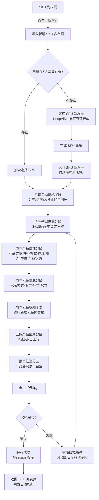
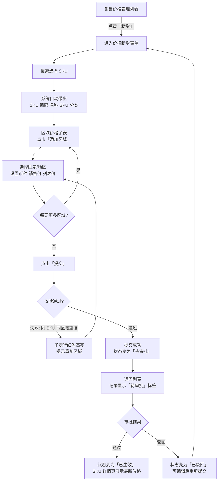
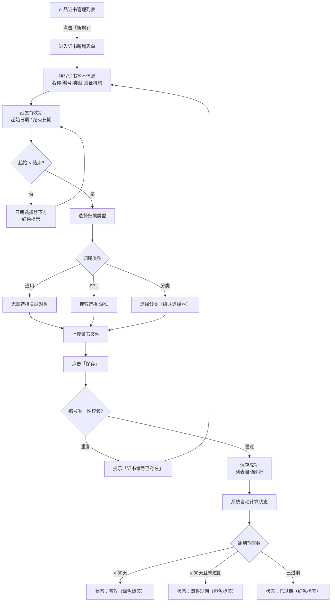

# UX Design Specification cross-border-erp

**Author:** 周雪
**Date:** 2026-04-13

---

<!-- UX design content will be appended sequentially through collaborative workflow steps -->

## Executive Summary

### Project Vision

跨境医疗器械 ERP 产品管理模块的 UX 目标：为 20-50 名内部用户（产品部、商务部、财务部、管理员）提供一个桌面端的产品主数据管理中心。系统管理约 8000+ SKU，覆盖分类、SPU、SKU、证书、资料、FAQ、价格等 9 个子模块，是整个 ERP 履约链路的数据源头。

UX 设计的核心命题：在数据关联深、字段量大、角色权限差异化的前提下，让每个角色都能高效完成本职数据维护，同时通过 SKU 详情页的聚合展示实现跨角色的信息统一视图。

### Target Users

| 角色 | 核心任务 | 使用频率 | UX 关注点 |
|------|----------|----------|-----------|
| 产品部 | 维护分类/SPU/SKU、证书、资料、FAQ | 日常高频 | 录入效率、继承逻辑可理解性、聚合展示完整性 |
| 商务部 | 维护 SKU 报关信息 | 按需中频 | 快速定位目标 SKU、报关字段区域清晰可达 |
| 财务部 | 维护区域价格、审批价格变更 | 按需中频 | 价格编辑效率、审批流状态可见 |
| 管理员 | 数据导入、枚举配置、权限管理 | 上线期高频/日常低频 | 批量操作反馈、系统配置可控感 |

使用环境：桌面端浏览器，中文界面，内部网络环境。

### Key Design Challenges

1. **深层数据关联的可理解性** — 5 层关联（分类→SPU→SKU→证书/资料/FAQ/价格），用户需直观感知层级关系和继承方向
2. **字段级权限的界面表达** — 同一页面不同角色看到不同的可编辑/只读/不可见状态，需自然传达权限边界
3. **SKU 详情页的信息密度管理** — 聚合 5 类关联数据，在完整性和可读性之间取得平衡
4. **轻量审批流嵌入** — 价格变更审批需在日常操作流中自然融入，不增加额外认知负担
5. **单条录入的效率优化** — SKU 日常以单条新增为主，字段多分区多，需最小化操作步骤

### Design Opportunities

1. **SPU→SKU 继承的"省心感"** — 自动填充 + 继承标记，让每次新增 SKU 都感受到系统在帮忙
2. **SKU 详情页作为"产品档案中心"** — 跨角色统一入口，一个页面解决所有产品信息查阅
3. **证书到期主动预警** — 从"被动记录"到"主动辅助"的体验升级，列表+状态标记让风险可见

## Core User Experience

### Defining Experience

核心体验围绕"产品数据的高效维护与快速查阅"展开。用户最高频的操作是 SKU 管理（新增、编辑、查看详情），系统的核心价值体现在两个方面：

1. **录入体验**：SKU 新增采用长表单平铺分区布局，所有字段一目了然，SPU 继承自动填充，一次性填完保存。用户不需要猜"还有什么没填"，也不需要在步骤之间来回切换。

2. **查阅体验**：SKU 详情页作为"产品档案中心"，聚合展示证书、资料、FAQ、价格，任何角色打开同一个 SKU 就能看到与自己相关的全部信息。

### Platform Strategy

- **平台**：桌面端 Web 应用（React + Ant Design 5.x + Tailwind CSS）
- **交互模式**：鼠标 + 键盘为主，充分利用桌面端的大屏空间
- **离线需求**：无，纯在线操作
- **浏览器**：现代浏览器（Chrome/Edge/Firefox），无需兼容 IE
- **关键前端特性**：顶部页签导航 + 页面缓存（KeepAlive），支持用户在 SPU/SKU/证书/资料等模块间快速来回切换而不丢失页面状态

### Effortless Interactions

以下交互应做到"零思考"：

1. **SPU 继承自动填充**：选择 SPU 后，分类、供应商、禁止经营国家等字段瞬间填入，并以视觉标记（如浅色底 + "继承自 SPU"提示）明确来源，用户无需手动录入或核对
2. **列表直接呈现全量数据**：8000+ SKU 列表默认全量加载（虚拟滚动），配合顶部筛选条件（分类、供应商、产品状态、产品类型、关键词）快速缩小范围，用户不需要"先选分类才能看到 SKU"
3. **页签缓存**：在 SKU 列表筛选到第 3 页后，切换到证书管理处理一个到期证书，再切回 SKU 列表时，筛选条件和滚动位置完好保留
4. **证书状态一眼可见**：列表中通过颜色标签（绿色有效/橙色即将过期/红色已过期）直接传达状态，无需点进详情才能判断

### Critical Success Moments

| 时刻 | 成功体验 | 失败体验 |
|------|----------|----------|
| 新增 SKU 选择 SPU 时 | 字段自动填充，用户感到"系统懂我" | 继承字段不明显，用户重复填写已有信息 |
| SKU 详情页打开时 | 一页之内看到所有关联信息，不用跳转 | 信息分散在多个页面，需要来回查找 |
| 跨模块切换时 | 页签切换秒回，之前的状态原封不动 | 切换后页面重新加载，筛选条件丢失 |
| 证书即将过期时 | 列表醒目标记，用户主动发现并处理 | 过期后才发现，影响发运合规 |
| 价格审批提交后 | 状态清晰可见，审批人可快速处理 | 不知道审批到了哪一步，需要反复询问 |

### Experience Principles

1. **平铺优于折叠** — 桌面端空间充足，信息分区平铺展示，让用户一眼看到全貌，不隐藏，不需要额外点击展开
2. **状态缓存优于重新加载** — 页签导航 + KeepAlive，用户在模块间切换时保留完整页面状态（筛选条件、滚动位置、展开状态）
3. **继承优于重复录入** — 凡是可以从上级实体继承的字段，自动填充并标记来源，减少录入量
4. **主动提示优于被动查找** — 证书到期、审批状态等关键信息主动呈现（颜色标签、角标、状态栏），不等用户来找
5. **聚合展示优于分散访问** — SKU 详情页是产品信息的单一入口，所有关联数据在同一页面内以 Tab/分区组织

## Desired Emotional Response

### Primary Emotional Goals

本系统的情感设计目标不追求"惊喜和愉悦"，而是追求内部工具的最高境界：**用着顺手，不碍事**。四个核心情感目标同等重要，共同构成用户体验基线：

| 情感目标 | 用户内心独白 | 优先级 |
|----------|-------------|--------|
| 掌控感 | "我知道数据在哪、状态是什么、接下来该做什么" | 核心 |
| 高效感 | "这个系统让我做事比以前快" | 核心 |
| 信任感 | "数据是准确的，系统不会让我犯错" | 核心 |
| 安心感 | "重要的事情系统会提醒我，不会遗漏" | 核心 |

### Emotional Journey Mapping

| 阶段 | 期望情感 | 设计支撑 |
|------|----------|----------|
| 打开系统 | 熟悉、可预期 | 页签缓存恢复上次状态，不需要重新导航 |
| 录入 SKU | 流畅、省力 | SPU 继承自动填充，长表单平铺分区，减少思考 |
| 查看 SKU 详情 | 掌控、全面 | 一页聚合所有关联数据，无需跳转 |
| 搜索/筛选 | 快速、精准 | 全量列表 + 筛选条件即时响应 |
| 跨模块切换 | 无缝、无损 | 页签缓存，切回时状态完好 |
| 遇到错误 | 清楚、不慌 | 简洁直接的错误提示，明确告知问题和操作方向 |
| 证书即将过期 | 提前知晓、从容 | 列表颜色标签主动提醒 |

### Micro-Emotions

**需要强化的正向微情感：**

- **确定感**：每个操作都有明确反馈（保存成功、提交成功、删除确认），用户不需要猜"刚才的操作生效了没有"
- **可预期感**：系统行为一致，同类操作在不同模块中表现相同（列表筛选、新增/编辑表单、详情页布局）
- **省力感**：继承字段自动填充、筛选条件保持、常用操作路径最短

**需要避免的负向微情感：**

- **迷失感**：不知道当前在哪个层级、数据从哪来
- **重复感**：同一个信息需要在多处手动填写
- **焦虑感**：不确定操作是否正确、不知道审批进度
- **被打断感**：跨模块切换后丢失之前的工作状态

### Design Implications

| 情感目标 | UX 设计决策 |
|----------|------------|
| 掌控感 | 面包屑导航清晰标识层级；列表页显示数据总量和当前筛选结果数；详情页分区标题明确 |
| 高效感 | 表单字段合理分区平铺，无折叠；继承字段自动填充；Tab 键支持表单字段间快速切换 |
| 信任感 | 数据校验即时反馈（字段失焦即校验）；唯一性冲突即时提示；关键操作（删除、下架）二次确认 |
| 安心感 | 证书状态颜色标签；审批状态标签（待审批/已通过/已驳回）；保存操作即时成功提示 |

### Emotional Design Principles

1. **简洁直接，不拐弯** — 错误提示、状态反馈、操作引导均采用简短中文直述，不加修饰语，不用模糊表达。示例："SKU编码已存在，请更换"而非"您输入的编码似乎与现有记录冲突，建议您..."
2. **一致即信任** — 所有模块的列表页、表单页、详情页遵循统一布局模式，用户学会一个模块的操作方式后，其他模块零学习成本
3. **反馈即安心** — 每个写操作（新增/编辑/删除/提交审批）都有明确的即时反馈（成功提示、失败原因），不让用户处于"不确定"状态
4. **状态可见即掌控** — 审批进度、证书有效期、产品状态等关键信息通过颜色标签在列表层级直接可见，不需要进入详情页才能了解

## UX Pattern Analysis & Inspiration

### Inspiring Products Analysis

**领星 ERP（Lingxing ERP）— 跨境电商 ERP 标杆**

领星 ERP 是跨境电商领域成熟的 SaaS 产品，服务亚马逊等平台卖家，覆盖产品、库存、订单、物流、财务全链路。其界面基于 Ant Design 体系，与本项目技术栈一致，且同为 B2B 后台管理场景，参考价值极高。

**领星做得好的地方：**

| 维度 | 分析 |
|------|------|
| 导航方式 | 左侧垂直菜单（一级/二级模块）+ 顶部页签（已打开的页面），双层导航让用户既能快速切换模块，又能在多个已打开页面间来回跳转，不丢失上下文 |
| 列表页清晰度 | 筛选条件平铺在表格上方，表格列紧凑但不拥挤，关键状态用颜色标签直接在列表中展示，用户扫一眼就能获取关键信息 |
| 信息密度 | 面向运营人员的高密度设计，充分利用桌面端宽屏空间，不浪费屏幕面积在装饰性元素上 |
| 操作效率 | 常用操作（编辑、查看详情）在列表行内直接可达，减少跳转层级 |

### Transferable UX Patterns

**导航模式：左侧菜单 + 顶部页签（KeepAlive）**

- 左侧垂直菜单承载模块导航（产品管理 > 分类/SPU/SKU/证书/资料/FAQ/价格）
- 顶部页签承载已打开的页面，支持 KeepAlive 缓存
- 用户点击左侧菜单打开新页签，点击顶部页签切换已有页面
- 页签支持关闭（关闭其他、关闭全部）
- 这正是用户明确要求的"顶部页签 + 页面缓存"需求的最佳实践

**列表页模式：筛选栏 + 操作栏 + 数据表格**

```
┌─────────────────────────────────────────────┐
│ 筛选区：分类 | 供应商 | 产品状态 | 关键词搜索  │
├─────────────────────────────────────────────┤
│ 操作栏：[新增] [导入]          共 8,234 条   │
├─────────────────────────────────────────────┤
│ 表格：编码 | 名称 | 型号 | 供应商 | 状态 | 操作│
│  ...                                         │
├─────────────────────────────────────────────┤
│ 分页：< 1 2 3 ... 412 >     每页 20 条      │
└─────────────────────────────────────────────┘
```

- 筛选条件平铺在表格上方，不使用弹窗或抽屉
- 操作栏（新增、导入等）位于筛选区和表格之间
- 数据总条数在操作栏右侧显示
- 表格列紧凑排布，状态列使用颜色标签

**表单页模式：平铺分区长表单**

- 表单字段按业务分区平铺（不折叠），每个分区有清晰的标题分割线
- 继承字段带视觉标记（浅色底 + 只读）
- 子表（如开票信息、包装明细）使用内嵌可编辑表格
- 页面底部固定操作栏（保存/取消），跟随滚动始终可见

**详情页模式：顶部摘要 + Tab 分区**

- 顶部展示核心摘要信息（编码、名称、状态、关键字段）
- 下方通过 Tab 组织关联数据（证书、资料、FAQ、价格）
- 每个 Tab 内使用独立的小型列表/表格展示关联记录

### Anti-Patterns to Avoid

| 反模式 | 问题 | 替代方案 |
|--------|------|----------|
| 弹窗堆叠 | 编辑表单用弹窗打开，弹窗内再弹弹窗选择关联数据 | 表单使用独立页面，关联选择使用下拉搜索 |
| 筛选条件隐藏在"高级搜索" | 用户每次都要多点一步才能筛选 | 常用筛选条件直接平铺展示 |
| 过度留白 | 桌面端大量空白区域浪费屏幕空间 | 紧凑布局，充分利用宽屏 |
| 表格无总数显示 | 用户不知道数据全貌有多少条 | 操作栏始终显示总条数 |
| 页面切换丢失状态 | 切换到其他模块后返回，筛选条件和滚动位置重置 | 顶部页签 + KeepAlive 缓存 |

### Design Inspiration Strategy

**采纳（直接使用）：**

- 左侧菜单 + 顶部页签 + KeepAlive 导航架构（领星验证过的成熟模式）
- 列表页三段式布局（筛选区 / 操作栏 / 数据表格）
- 状态颜色标签在列表中直接展示
- 数据总条数在操作栏显示

**适配（根据场景调整）：**

- 领星面向电商卖家，列表列可能更多；本项目用户少（20-50人），可适度降低列密度，优先保证可读性
- 领星的 SKU 无 SPU 继承概念；本项目需要在表单中明确设计继承字段的视觉表达
- 本项目的证书到期预警、价格审批是领星没有的场景，需要自行设计状态流转 UI

**规避：**

- 不使用弹窗承载编辑表单（表单字段多，弹窗空间不足）
- 不使用折叠面板隐藏表单分区（违背"平铺优于折叠"原则）
- 不使用步骤条向导录入 SKU（用户偏好一页平铺）

## Design System Foundation

### Design System Choice

**基础框架：** Ant Design 5.x（主组件库）+ Tailwind CSS（布局辅助）

这是"成熟设计系统 + 轻量定制"的混合模式。Ant Design 提供 ERP 场景所需的全部核心组件（Table、Form、Cascader、Tabs、Tag、Modal 等），Tailwind CSS 负责布局间距和快速样式微调。对于 20-50 人使用的内部 ERP，这是开发效率和体验质量的最优平衡。

### Rationale for Selection

| 决策因素 | 分析 |
|----------|------|
| 场景匹配 | Ant Design 源自蚂蚁金服企业级产品，与 ERP 表格/表单/级联选择场景天然契合 |
| 中文生态 | 组件默认支持中文，文档和社区以中文为主 |
| 开发效率 | 开箱即用的复杂组件（可编辑表格、树形选择、级联选择器），AI 辅助开发可直接引用 |
| 领星参考 | 领星 ERP 同样基于 Ant Design 体系，验证了该方案在跨境 ERP 场景的可行性 |
| 架构一致 | 架构文档已确定技术栈，设计系统与技术选型完全对齐 |

### Implementation Approach

**Ant Design 主题定制（ConfigProvider）：**

```typescript
// theme/config.ts
const theme = {
  token: {
    // 主色：沉稳正红
    colorPrimary: '#C41D2E',
    // 圆角：适度圆角，商务感
    borderRadius: 4,
    // 字体：系统默认中文字体栈
    fontFamily: '-apple-system, BlinkMacSystemFont, "Segoe UI", "PingFang SC", "Hiragino Sans GB", "Microsoft YaHei", sans-serif',
  },
  components: {
    Table: {
      // 中等密度
      cellPaddingBlock: 12,
      cellPaddingInline: 12,
    },
  },
}
```

**Tailwind CSS 配置：**

```typescript
// tailwind.config.ts
export default {
  important: '#root', // 解决与 Ant Design 样式优先级冲突
  theme: {
    extend: {
      colors: {
        primary: '#C41D2E',
      },
    },
  },
}
```

### Customization Strategy

**色彩体系：**

| 用途 | 色值 | 说明 |
|------|------|------|
| 主色 | `#C41D2E` | 按钮、导航高亮、链接、选中状态 |
| 成功/有效 | Ant Design 默认绿 `#52c41a` | 证书有效、操作成功 |
| 警告/即将过期 | Ant Design 默认橙 `#faad14` | 证书即将过期 |
| 错误/已过期 | Ant Design 默认红 `#ff4d4f` | 证书已过期、表单校验错误 |
| 中性色 | Ant Design 默认灰阶 | 文字、边框、背景、分割线 |

**组件使用规范：**

| 场景 | 组件选择 | 说明 |
|------|----------|------|
| 数据列表 | `Table`（size="middle"） | 中等密度，所有列表页统一 |
| 表单 | `Form` + 各表单控件 | 长表单平铺分区，不折叠 |
| 分类选择 | `Cascader` | 三级联动 |
| 供应商/SPU 选择 | `Select` + 远程搜索 | 支持关键词搜索 |
| 状态标签 | `Tag` + 颜色 | 绿/橙/红对应有效/即将过期/已过期 |
| 页签导航 | `Tabs`（type="editable-card"） | 顶部页签，支持关闭 |
| 左侧菜单 | `Menu`（mode="inline"） | 垂直菜单，支持折叠 |
| 确认操作 | `Popconfirm` | 删除、下架等关键操作二次确认 |
| 操作反馈 | `message` | 顶部轻提示（保存成功/失败） |
| 子表 | `Table`（内嵌可编辑行） | 开票信息、包装明细、区域价格 |
| 文件上传 | `Upload` | 图片、证书、资料文件 |

**不使用的组件/模式：**

- `Modal` 不用于编辑表单（字段多，空间不足）——编辑走独立页面
- `Collapse` 不用于表单分区——平铺展示
- `Steps` 不用于录入流程——一页完成

## Defining Core Experience

### Defining Experience

本系统的定义性交互是一条完整的"录入-查阅"闭环：

> **选择 SPU → 系统自动填充 → 平铺录入 → 一键保存 → 详情页聚合查阅**

这条闭环贯穿用户最高频的操作场景。如果这个流程做到"顺手、不碍事"，用户对整个系统的信心就建立起来了。其他模块（证书、资料、FAQ、价格）的 CRUD 操作都是同一模式的变体，核心体验一致。

### User Mental Model

**用户的心智模型：**

用户把产品数据理解为一棵树：

```
分类（大类 > 中类 > 小类）
  └── SPU（一个型号 = 一个供应商）
        └── SKU（不同规格/配置）
              ├── 证书（这个产品有哪些认证）
              ├── 资料（说明书、参数表等）
              ├── FAQ（常见问题）
              └── 价格（各区域售价）
```

**关键认知：**
- 用户先想到"型号"（SPU），再想到"具体规格"（SKU）
- "一个 SPU 只对应一个供应商"是根深蒂固的业务认知，系统需强化而非违背
- 证书、资料、FAQ 是"附属在产品上的"，不是独立存在的——SKU 详情页的聚合展示正好匹配这个心智模型

**操作习惯预期：**
- 列表 → 点击 → 详情/编辑，这是所有后台系统的通用模式，无需教育
- 筛选条件应与用户思考方式一致：先按分类缩小范围，或直接搜编码/名称
- 表单保存后期望看到成功提示并留在当前页面，不自动跳转回列表

### Success Criteria

**核心交互的成功标准：**

| 指标 | 成功标准 |
|------|----------|
| SKU 新增完成时间 | 选择 SPU 后，填写剩余字段到保存，目标 3 分钟以内（不含图片上传） |
| 继承字段可理解性 | 用户无需询问即能理解哪些字段来自 SPU、为什么不可编辑 |
| 详情页信息查找 | 用户在 SKU 详情页找到任意关联数据（证书/资料/FAQ/价格）不超过 2 次点击（切换 Tab） |
| 跨模块切换无损 | 切换页签后返回，页面状态（筛选、滚动、展开）100% 保留 |
| 错误恢复 | 表单校验失败后，用户 5 秒内理解问题并修正 |

### Novel UX Patterns

本项目以**成熟模式**为主，不引入用户需要学习的新交互：

**使用成熟模式：**
- 列表-详情-编辑三页模式（所有后台系统通用）
- 表格 + 筛选 + 分页（Ant Design Table 标准用法）
- 表单分区平铺（传统 ERP 表单模式）
- Tab 切换关联数据（通用详情页模式）
- 左侧菜单 + 顶部页签导航（领星等成熟 ERP 验证）

**在成熟模式上的微创新：**
- **继承字段视觉标记**：选择 SPU 后，继承字段以浅灰底色 + 小标签"继承自 SPU"展示，既表明只读原因，又传达数据来源——这不是新交互模式，只是在只读字段上增加了上下文信息
- **证书状态颜色体系**：列表中直接用绿/橙/红标签展示有效期状态——借鉴了监控仪表盘的红绿灯模式，用户无需学习

### Experience Mechanics

**核心流程：SKU 新增**

```
1. 发起
   用户在 SKU 列表页点击 [新增] 按钮
   → 打开 SKU 新增页面（新页签）

2. SPU 选择与继承
   用户在"基础信息"分区选择所属 SPU（下拉搜索，支持 SPU 编码/名称模糊匹配）
   → 系统即时自动填充继承字段：
     - 一级/二级/三级分类（灰底只读 + "继承自 SPU"标签）
     - 供应商（灰底只读 + "继承自 SPU"标签）
     - 禁止经营国家（灰底只读 + "继承自 SPU"标签）
     - 客户质保期（灰底只读 + "继承自 SPU"标签）

3. 表单填写（平铺分区，从上到下）
   分区一：基础信息
     SKU编码（手动输入，失焦校验唯一性）、SKU中文名称、SKU英文名称、产品型号、产品类型

   分区二：产品属性
     核心参数、产品状态（默认"上架"）、电参数、原理、用途、产品材质、单位、有无插头

   分区三：特殊属性
     是否特殊属性（开关）、特殊属性说明（开关为"是"时展示）

   分区四：包装信息 + 包装明细
     包装类型、包装数量
     包装明细子表（可编辑表格：净重/毛重/长/宽/高/体积，支持新增行/删除行）

   分区五：报关信息
     产品部视角：全部字段灰底只读，顶部提示"报关信息由商务部维护"
     商务部视角：字段可编辑（HSCODE、监管条件、申报要素、退税税点、是否已维护）

   分区六：产品图片
     拖拽上传区域，支持多张图片，缩略图预览

4. 保存反馈
   用户点击页面底部固定操作栏 [保存] 按钮
   → 表单全量校验
     - 通过：顶部 message 提示"保存成功"，停留在当前页面（编辑模式）
     - 失败：滚动到第一个错误字段，字段下方红色提示具体错误原因

5. 查阅验证
   用户在 SKU 列表中找到刚创建的 SKU，点击进入详情页
   → 详情页顶部：SKU 编码、名称、状态、SPU、供应商等核心摘要
   → 下方 Tab 分区：
     - 基础信息（全部字段）
     - 产品证书（关联的证书列表，含状态标签）
     - 产品资料（关联的资料列表）
     - FAQ（关联的 FAQ 列表）
     - 销售价格（关联的区域价格表，只读）
```

**辅助流程：列表筛选定位**

```
1. 用户进入 SKU 列表页
   → 默认展示全量数据（分页），操作栏显示"共 8,234 条"
2. 用户使用筛选条件缩小范围
   → 筛选条件平铺在表格上方：分类（级联）、供应商、产品状态、产品类型、关键词
   → 选择筛选条件后即时刷新列表，总数更新为"共 156 条"
3. 用户切换到其他页签处理其他事务
4. 用户点击顶部页签切回 SKU 列表
   → 筛选条件、页码、滚动位置完好保留
```

## Visual Design Foundation

### Color System

**主色阶（基于 Ant Design 色阶算法自动生成）：**

| 色阶 | 色值 | 用途 |
|------|------|------|
| primary-1 | 自动生成（极浅红） | 选中行背景、hover 背景 |
| primary-2 | 自动生成（浅红） | 次级背景 |
| primary-5 | `#C41D2E` | **主色**——按钮、链接、导航高亮、选中态 |
| primary-6 | 自动生成（深红） | 按钮 hover |
| primary-7 | 自动生成（更深红） | 按钮 active |

**语义色：**

| 语义 | 色值 | 场景 |
|------|------|------|
| 成功 | `#52c41a` | 保存成功提示、证书"有效"标签 |
| 警告 | `#faad14` | 证书"即将过期"标签 |
| 错误 | `#ff4d4f` | 表单校验错误、证书"已过期"标签 |
| 信息 | `#1677ff` | 信息提示、辅助链接 |

**中性色（Ant Design 默认灰阶）：**

| 用途 | 色值 |
|------|------|
| 标题文字 | `rgba(0,0,0,0.88)` |
| 正文文字 | `rgba(0,0,0,0.65)` |
| 辅助文字/Placeholder | `rgba(0,0,0,0.45)` |
| 禁用文字 | `rgba(0,0,0,0.25)` |
| 边框 | `#d9d9d9` |
| 分割线 | `#f0f0f0` |
| 页面背景 | `#f5f5f5` |
| 卡片/容器背景 | `#ffffff` |
| 继承字段背景 | `#fafafa`（浅灰底，标识只读继承） |

### Typography System

**字体栈（系统默认中文字体）：**

```css
font-family: -apple-system, BlinkMacSystemFont, "Segoe UI",
  "PingFang SC", "Hiragino Sans GB", "Microsoft YaHei",
  "Helvetica Neue", Helvetica, Arial, sans-serif;
```

**字号层级：**

| 层级 | 字号 | 行高 | 字重 | 用途 |
|------|------|------|------|------|
| 页面标题 | 20px | 28px | 600 | 页面顶部标题（如"SKU 管理"） |
| 分区标题 | 16px | 24px | 600 | 表单分区标题（如"基础信息"、"产品属性"） |
| 表格表头 | 14px | 22px | 600 | 表格列标题 |
| 正文/表格内容 | 14px | 22px | 400 | 表格数据、表单标签、正文 |
| 辅助文字 | 12px | 20px | 400 | 字段提示、"继承自 SPU"标签、时间戳 |

**设计原则：**
- 全系统统一 14px 正文字号，不做模块级别字号差异
- 只用 400（Regular）和 600（Semi-Bold）两个字重，不用 Bold 或 Light
- 中文界面不使用斜体

### Spacing & Layout Foundation

**间距体系（基于 4px 基础单位，偏紧凑）：**

| Token | 值 | 用途 |
|-------|-----|------|
| spacing-xs | 4px | 标签与文字间距、图标与文字间距 |
| spacing-sm | 8px | 表单控件内部间距、表格单元格内间距 |
| spacing-md | 12px | 表单字段之间行间距、筛选条件之间间距 |
| spacing-lg | 16px | 分区之间间距、卡片内边距 |
| spacing-xl | 24px | 页面区块之间间距（筛选区与表格之间） |

**整体布局结构：**

```
┌──────────────────────────────────────────────────────┐
│ 顶部页签栏（高度 40px，固定定位）                        │
├────────┬─────────────────────────────────────────────┤
│        │ 面包屑（高度 32px）                            │
│ 左侧   ├─────────────────────────────────────────────┤
│ 菜单   │                                              │
│        │ 内容区域                                      │
│ 宽度   │ （左右内边距 16px，上内边距 12px）              │
│ 200px  │                                              │
│        │                                              │
│ 可折叠  │                                              │
│ 至60px │                                              │
├────────┴─────────────────────────────────────────────┤
│ 固定底部操作栏（表单页专用，高度 56px）                   │
└──────────────────────────────────────────────────────┘
```

**列表页布局规范：**

| 区域 | 高度/间距 | 说明 |
|------|----------|------|
| 筛选区 | 自适应，控件间距 12px | 白色底色卡片，圆角边框，筛选条件水平排列，超出换行 |
| 筛选区与操作栏间距 | 12px | 紧凑 |
| 操作栏 | 40px | 左侧操作按钮 |
| 操作栏与表格间距 | 12px | 紧凑 |
| 表格行高 | 由 Table size="middle" 决定 | 单元格上下 padding 12px |
| 分页栏 | 48px | 表格底部，左侧显示数据总条数，右侧分页控件 |

**表单页布局规范：**

| 区域 | 间距 | 说明 |
|------|------|------|
| 分区标题与第一行字段 | 12px | 紧凑 |
| 字段行间距 | 12px | 表单 Item 之间 |
| 分区之间 | 24px + 分割线 | 视觉分区清晰 |
| 表单宽度 | 撑满内容区域 | 字段按 3 列 grid 布局，不足 3 个时不拉伸，右侧留空 |
| 底部固定操作栏 | 高度 56px，内边距 16px，按钮居中 | 保存/取消按钮始终可见，居中对齐 |

### Accessibility Considerations

| 项目 | 标准 | 说明 |
|------|------|------|
| 色彩对比度 | WCAG AA（4.5:1） | 主色 `#C41D2E` 在白色背景上对比度约 6.5:1，符合 AA |
| 不依赖纯色彩 | 标签 + 文字双重标识 | 证书状态标签除颜色外，同时显示文字（"有效"/"即将过期"/"已过期"） |
| 键盘导航 | Tab 键遍历表单 | 表单字段支持 Tab 键顺序切换 |
| 字号下限 | 12px | 最小字号不低于 12px，保证可读性 |
| 交互目标尺寸 | 最小 32px | 可点击元素（按钮、链接、选择器）最小点击区域 32x32px |

## Design Direction

### Selected Direction: A — Classic ERP（红色强调条）

**选择理由：** 最接近领星 ERP 风格，信息密度最高，学习成本最低，适合内部 ERP 高频操作场景。

**方向 A 核心视觉特征：**

| 元素 | 样式 |
|------|------|
| 左侧菜单 | 深色背景 `#001529`，选中项 `#C41D2E` 红色背景 |
| 顶部页签 | 白色背景，选中项红色底部边框 + 红色文字 |
| 表单分区标题 | 左侧 3px 红色竖线 + `#C41D2E` 红色标题文字 |
| 详情页摘要 | 白底卡片，紧凑布局 |
| 表格行 hover | 极浅灰底 `#fafafa` |

**用户要求的调整（已纳入规范）：**

1. **列表页筛选区**：使用白色底色卡片（`background: #fff`，圆角 4px，1px `#f0f0f0` 边框），与灰色页面背景形成层次区分
2. **数据总条数位置**：从操作栏移至分页栏左侧，与分页控件同行显示（左侧"共 X 条"，右侧分页按钮）
3. **表单页宽度**：撑满内容区域，不设 `max-width` 限制；字段采用 `grid-template-columns: repeat(3, 1fr)` 三列等宽布局，不足 3 个字段时不拉伸，右侧自然留空
4. **保存/取消按钮**：底部固定操作栏内居中对齐（`justify-content: center`）

**Mockup 参考文件：** `_bmad-output/planning-artifacts/ux-design-directions.html`

## User Journey Flows

### 旅程一：产品部 — 新增 SKU

**场景：** 产品部同事录入一款新型号设备的 SKU



**关键交互细节：**

| 交互点 | 设计 |
|--------|------|
| SPU 搜索选择 | Select + 远程搜索，输入关键词后下拉显示 SPU 编码+名称 |
| 字段继承 | 选择 SPU 后，继承字段自动填充且显示为只读灰色背景 + "继承自 SPU" 标签 |
| 跳转新增 SPU | 当前 SKU 表单通过 KeepAlive 缓存，新开页签进入 SPU 新增 |
| 保存校验失败 | 红色边框标记错误字段，页面自动滚动到第一个错误处，字段下方显示红色错误提示 |
| SKU 编码唯一性 | 输入后失焦触发实时校验，重复时立即提示"SKU编码已存在，请更换" |

### 旅程三：财务部 — 设置区域价格

**场景：** 财务部为新上架 SKU 设置全球及分区价格



**关键交互细节：**

| 交互点 | 设计 |
|--------|------|
| SKU 搜索 | 与 SKU 列表同样的远程搜索模式 |
| 区域价格子表 | 可编辑表格，每行一个区域，支持新增/删除行 |
| 重复校验 | 同 SKU 同区域不可重复，提交时校验，行级高亮 |
| 审批状态标签 | 颜色标签：待审批（蓝）、已生效（绿）、已驳回（红） |
| 价格展示 | SKU 详情页"销售价格"分区只展示"已生效"的最新价格 |

### 旅程五：产品部 — 管理产品证书

**场景：** 产品部为某 SPU 录入 CE 证书并管理到期预警



**关键交互细节：**

| 交互点 | 设计 |
|--------|------|
| 归属类型切换 | Radio 按钮组切换，切换时清空已选关联对象 |
| 证书状态自动标记 | 无需人工操作，系统根据有效期自动计算，列表标签颜色区分 |
| 到期预警阈值 | 默认 30 天，系统配置项 |
| 证书文件上传 | 支持 PDF/JPG/PNG，单文件上传，显示文件名和大小 |
| SKU 详情聚合 | 证书关联 SPU 时，该 SPU 下 SKU 的详情查询可聚合展示该证书，不写回 SKU 主表 |

### 跨旅程通用模式

| 模式 | 描述 | 应用旅程 |
|------|------|----------|
| **远程搜索选择** | Select + 关键词远程搜索，统一交互：输入 2 字符后触发搜索，下拉展示编码+名称 | SPU 选择、SKU 选择 |
| **列表→表单→列表** | 列表页点击操作 → 新开页签进入表单 → 保存后返回列表自动刷新 | 全部旅程 |
| **KeepAlive 页签缓存** | 编辑中跳转其他页面，当前页面状态缓存不丢失 | SKU 新增中跳转 SPU 新增 |
| **保存校验反馈** | 红色边框 + 滚动定位 + 字段下方提示文字，统一错误处理模式 | 全部表单 |
| **状态标签色彩** | 绿色=正常/有效，蓝色=进行中/待处理，橙色=预警，红色=失败/过期 | 证书状态、审批状态 |
| **唯一性实时校验** | 编码类字段失焦触发实时校验，重复时立即反馈 | SKU 编码、证书编号 |

### 流程优化原则

| 原则 | 实现方式 |
|------|----------|
| 最少步骤到达目标 | 表单平铺一页完成，无步骤向导，减少页面跳转 |
| 降低每步认知负荷 | 分区标题红色竖线视觉分隔，相关字段集中放置 |
| 清晰的进度反馈 | 保存成功 Message 提示，列表自动刷新确认结果 |
| 优雅的错误恢复 | 校验失败自动滚动定位，不清空已填内容，逐字段提示 |
| 边界场景处理 | KeepAlive 缓存中途跳转，唯一性实时校验避免提交后才报错 |

## Component Strategy

### Design System 组件覆盖

基于 Ant Design 5.x，以下组件可直接使用：

| 场景 | AntD 组件 | 用途 |
|------|-----------|------|
| 列表页 | `Table`（size="middle"） | SKU/SPU/证书/资料列表 |
| 筛选区 | `Form` + `Input` / `Select` / `DatePicker` | 列表筛选条件 |
| 表单页 | `Form` + `Input` / `Select` / `InputNumber` / `DatePicker` | 新增/编辑表单 |
| 远程搜索 | `Select` + `filterOption=false` + `onSearch` | SPU/SKU 远程搜索选择 |
| 级联选择 | `Cascader` | 三级分类选择 |
| 文件上传 | `Upload` / `Upload.Dragger` | 图片、证书文件上传 |
| 可编辑子表 | `Table` + `Form.List` | 包装明细、区域价格 |
| 页签导航 | `Tabs` | 顶部 KeepAlive 页签 |
| 侧边菜单 | `Layout.Sider` + `Menu` | 左侧导航菜单 |
| 状态标签 | `Tag` | 证书状态、审批状态、产品状态 |
| 消息反馈 | `message` / `Modal.confirm` | 保存成功、删除确认 |
| 分页 | `Pagination`（集成在 Table 中） | 列表分页 |

### Custom Components

以下为 Ant Design 原生组件无法直接覆盖的自定义组件：

#### 1. InheritedField（继承字段）

| 属性 | 说明 |
|------|------|
| **用途** | 展示从 SPU 继承的只读字段值 |
| **内容** | 字段标签 + 值 + "继承自 SPU" 灰色小标签 |
| **状态** | 只读（灰色背景 `#fafafa`，禁用输入） |
| **实现** | 包装 `Form.Item` + `Input` disabled + `Tag` |
| **无障碍** | `aria-readonly="true"`，标签关联 `htmlFor` |

#### 2. SectionTitle（分区标题）

| 属性 | 说明 |
|------|------|
| **用途** | 表单分区视觉分隔 |
| **内容** | 左侧 3px `#C41D2E` 竖线 + 红色标题文字（16px medium） |
| **变体** | 无 |
| **实现** | `div` + `border-left: 3px solid #C41D2E` + `padding-left: 8px` |
| **无障碍** | 使用 `role="heading" aria-level="3"` |

#### 3. FixedActionBar（底部固定操作栏）

| 属性 | 说明 |
|------|------|
| **用途** | 表单页底部固定的保存/取消按钮区域 |
| **内容** | 居中的按钮组（主按钮"保存" + 默认按钮"取消"） |
| **样式** | 高度 56px，白色背景，顶部 1px `#f0f0f0` 分隔线，`box-shadow: 0 -2px 8px rgba(0,0,0,0.06)` |
| **定位** | `position: fixed; bottom: 0`，宽度跟随内容区 |
| **状态** | 保存中：主按钮 loading 态，禁用取消 |
| **无障碍** | `role="toolbar"`，按钮支持 Tab 键切换 |

#### 4. FilterCard（筛选区卡片）

| 属性 | 说明 |
|------|------|
| **用途** | 列表页筛选条件的容器 |
| **内容** | 包裹 AntD Form 筛选控件 |
| **样式** | 白色背景、圆角 4px、1px `#f0f0f0` 边框、内边距 16px 16px 0 16px |
| **实现** | 简单 `div` 样式封装 |

#### 5. PaginationBar（分页栏）

| 属性 | 说明 |
|------|------|
| **用途** | 替代 Table 内置分页，左侧显示总数，右侧分页控件 |
| **内容** | 左："共 {total} 条"；右：AntD `Pagination` |
| **样式** | `display: flex; justify-content: space-between; align-items: center`，高度 48px，上边距 12px |

#### 6. CacheTabs（缓存页签）

| 属性 | 说明 |
|------|------|
| **用途** | 顶部页签导航 + 页面缓存（KeepAlive） |
| **内容** | 页签标题 + 关闭按钮，选中态红色底部边框 |
| **功能** | 新开页签、关闭页签、右键菜单（关闭其他/关闭所有）、页面缓存 |
| **实现** | AntD `Tabs` + `react-activation` KeepAlive 集成 |
| **无障碍** | `role="tablist"`，支持方向键切换页签 |

#### 7. FormSectionCard（新增/编辑页分区卡片）

| 属性 | 说明 |
|------|------|
| **用途** | 承载新增/编辑页的一级信息块（基础信息、采购信息、开票信息等） |
| **内容** | 卡片头部标题 + 内容区 |
| **样式** | 白色背景、圆角 4px、1px `#f0f0f0` 边框、内边距 `16px` |
| **间距** | 多个卡片之间默认垂直间距 `16px` |
| **实现** | 内部可组合 `SectionTitle`、`FormGrid`、`Form.List` 子表 |

### Component Implementation Strategy

- 所有自定义组件基于 Ant Design 5.x Design Token 构建，确保与系统主题一致
- 使用 Tailwind CSS 处理布局和间距，AntD Token 处理颜色和字号
- 组件统一放置于 `src/components/` 目录，按功能分类
- 每个组件导出 TypeScript 类型定义，Props 接口清晰

### Implementation Roadmap

| 阶段 | 组件 | 优先级原因 |
|------|------|------------|
| **Phase 1（核心骨架）** | CacheTabs、SectionTitle、FixedActionBar、FilterCard | 所有页面都依赖的布局骨架组件 |
| **Phase 2（业务组件）** | InheritedField、PaginationBar、FormSectionCard | 新增/编辑页统一分区容器与列表页核心业务组件 |
| **Phase 3（增强封装）** | EditableTable（基于 AntD Table + Form.List） | 包装明细、区域价格的复用封装 |

## UX Consistency Patterns

### Button Hierarchy（按钮层级）

| 层级 | 样式 | 使用场景 | 位置 |
|------|------|----------|------|
| **主操作** | `type="primary"` 红色 `#C41D2E` | 保存、提交、新增 | 每个视图区域最多 1 个主按钮 |
| **次操作** | `type="default"` 默认边框 | 取消、重置、导出、批量操作 | 主按钮旁或操作栏 |
| **危险操作** | `danger` 红色文字/边框 | 删除、批量删除 | 操作列末位或批量操作栏 |
| **文字按钮** | `type="link"` | 表格行内操作（编辑/查看/删除） | 表格操作列，用分隔符 `\|` 隔开 |

**按钮位置规则：**
- 列表页操作栏：左侧主按钮（新增）+ 批量操作按钮，右侧辅助按钮（导出）
- 表单页底部栏：居中，主按钮（保存）在左，次按钮（取消）在右
- 表格行操作列：文字按钮，顺序为 编辑 | 查看 | 删除

### Feedback Patterns（反馈模式）

| 场景 | 组件 | 持续时间 | 内容格式 |
|------|------|----------|----------|
| **操作成功** | `message.success` | 3 秒自动消失 | "保存成功" / "删除成功" |
| **操作失败** | `message.error` | 5 秒自动消失 | "保存失败：{具体原因}" |
| **警告提示** | `message.warning` | 5 秒自动消失 | "该 SKU 已有报关信息，修改需商务部确认" |
| **删除确认** | `Modal.confirm` | 用户手动关闭 | 标题："确认删除"；内容："删除后不可恢复，确定删除 {对象名称}？" |
| **批量删除确认** | `Modal.confirm` | 用户手动关闭 | "确定删除选中的 {N} 条记录？删除后不可恢复" |
| **字段校验错误** | `Form.Item` 红色提示 | 持续直到修正 | 字段下方红色文字，如"此字段为必填项" |
| **唯一性冲突** | `Form.Item` 红色提示 | 失焦触发 | "SKU编码已存在，请更换" |

### Form Patterns（表单模式）

**布局规则：**

| 规则 | 说明 |
|------|------|
| 整体布局 | `display: grid; grid-template-columns: repeat(3, 1fr); gap: 16px 24px` |
| 不足 3 字段 | 不拉伸，右侧留空（不设 `grid-column: span`） |
| 跨列字段 | 备注、描述等长文本字段 `grid-column: 1 / -1` 占满整行 |
| 标签位置 | 顶部对齐（`layout="vertical"`），标签 12px 灰色 |
| 必填标记 | 红色 `*` 在标签前 |
| 分区分隔 | `SectionTitle` 组件，`grid-column: 1 / -1` 占满整行 |

**新增/编辑页卡片规则：**

| 规则 | 说明 |
|------|------|
| 一级信息块 | 默认拆为独立白色卡片，不在一个连续大白底里堆多个分区 |
| 卡片之间间距 | `16px` |
| 卡片内边距 | `16px` |
| 卡片内表单节奏 | `FormGrid columnGap = 24px`、`rowGap = 16px` |
| 普通字段底部留白 | 不再叠加大于 `16px` 的额外 `Form.Item` 底部间距 |

**校验规则：**

| 时机 | 行为 |
|------|------|
| 提交时 | 全量校验，滚动到第一个错误字段 |
| 失焦时 | 唯一性字段（编码类）实时校验 |
| 输入时 | 不做实时校验，避免干扰输入 |
| 校验失败 | 红色边框 + 字段下方红色文字，不清空已填内容 |

**只读字段：**

| 场景 | 表现 |
|------|------|
| 继承字段 | `InheritedField` 组件：灰色背景 + "继承自 SPU" 标签 |
| 权限只读 | 普通 `Input` disabled，灰色背景，无特殊标签 |
| 创建后不可改 | 编辑模式下 disabled，tooltip 提示"创建后不可修改" |

### Navigation Patterns（导航模式）

| 模式 | 行为 |
|------|------|
| **左侧菜单** | 深色背景，支持收起/展开，选中项红色高亮，支持多级子菜单 |
| **顶部页签（CacheTabs）** | KeepAlive 缓存页面状态，关闭页签清除缓存，右键菜单支持"关闭其他""关闭所有" |
| **列表→表单跳转** | 点击"新增/编辑"新开页签，保存成功后自动关闭当前页签并刷新列表页签 |
| **表单离开** | KeepAlive 缓存，切换页签不丢失数据，不弹未保存提醒 |
| **面包屑** | 不使用面包屑（页签导航已足够定位，避免冗余） |

### Batch Operations（批量操作模式）

| 元素 | 设计 |
|------|------|
| **触发** | 表格左侧复选框列，表头全选 |
| **选中反馈** | 选中行浅蓝背景 `#e6f4ff`，操作栏显示"已选 {N} 条" |
| **批量操作栏** | 选中后在操作栏左侧显示批量按钮（批量删除等），未选中时隐藏 |
| **批量删除** | `Modal.confirm` 确认，显示选中条数 |
| **跨页选中** | 支持跨页选中，切换分页保留已选状态 |

### Empty & Loading States（空状态与加载）

| 场景 | 表现 |
|------|------|
| **列表无数据** | AntD `Empty` 默认插图 + "暂无数据"，筛选后无结果显示"未找到匹配数据，请调整筛选条件" |
| **表格加载中** | `Table` 内置 `loading` 骨架，Spin 遮罩 |
| **表单加载中** | 整页 `Spin` 居中，编辑模式数据加载完后渲染表单 |
| **按钮提交中** | 按钮 `loading` 态，禁用重复点击 |
| **文件上传中** | 进度条显示上传百分比 |

### Search & Filter Patterns（搜索与筛选）

| 规则 | 说明 |
|------|------|
| **筛选区容器** | `FilterCard` 白色卡片，与表格视觉分层 |
| **筛选控件排列** | 水平排列，超出换行，每行 3-4 个控件 |
| **查询/重置按钮** | 筛选区末尾，"查询"主按钮 + "重置"文字按钮 |
| **查询触发** | 点击"查询"按钮触发，不做输入即时搜索 |
| **重置行为** | 清空所有筛选条件，重新加载默认列表 |
| **筛选条件持久化** | 切换页签返回时，KeepAlive 保留筛选条件和分页状态 |

## Responsive Design & Accessibility

### Desktop Adaptation Strategy（桌面屏幕适配）

**支持分辨率范围：** 1366x768（笔记本）至 1920x1080（标准桌面）及以上

| 策略 | 说明 |
|------|------|
| **最小宽度** | 内容区最小宽度 1100px，低于此值出现水平滚动条 |
| **侧边栏** | 固定宽度 208px（展开）/ 48px（收起），笔记本用户可收起侧边栏节省空间 |
| **内容区** | `flex: 1` 自适应剩余宽度，表格列宽按比例分配 |
| **表单三列布局** | `grid-template-columns: repeat(3, 1fr)`，在小屏笔记本上每列自然压缩，不切换为两列 |
| **表格适配** | 列较多时启用 `scroll.x`，固定操作列在右侧（`fixed: 'right'`） |
| **大屏利用** | 2K/4K 屏幕不额外拉伸布局，内容区保持自然宽度，两侧不留大量空白 |

**断点定义（仅桌面端）：**

| 断点 | 宽度 | 适配行为 |
|------|------|----------|
| 笔记本 | 1366px - 1599px | 建议收起侧边栏，表格可横向滚动 |
| 标准桌面 | 1600px - 1919px | 侧边栏展开，表格完整显示 |
| 大屏桌面 | 1920px+ | 同标准桌面，内容区自然填充 |

### Accessibility Strategy（基础无障碍）

**合规级别：** 基础无障碍（参考 WCAG AA 关键项，不做完整合规认证）

**已在设计中保障的无障碍项：**

| 项目 | 状态 | 说明 |
|------|------|------|
| 色彩对比度 | 已达标 | 主色 `#C41D2E` 在白底上对比度 6.5:1（AA 要求 4.5:1） |
| 不依赖纯色彩 | 已达标 | 状态标签同时显示颜色和文字（"有效""即将过期""已过期"） |
| 最小字号 | 已达标 | 系统最小字号 12px |
| 最小点击区域 | 已达标 | 可交互元素最小 32x32px |

**开发需遵循的基础无障碍规则：**

| 规则 | 实现方式 |
|------|----------|
| **键盘导航** | 表单字段支持 Tab 键顺序遍历（AntD 组件自带） |
| **语义化 HTML** | 使用 `<header>`、`<nav>`、`<main>`、`<section>` 等语义标签 |
| **表单标签关联** | 所有 `Form.Item` 的 `label` 自动关联 `htmlFor`（AntD 自带） |
| **焦点可见** | 保留浏览器默认 focus outline，不使用 `outline: none` |
| **图片 alt 属性** | 产品图片 `` 必须有 `alt` 属性，值为产品名称 |

**明确不做的项（内部系统不需要）：**
- 屏幕阅读器专项优化
- 完整 ARIA role/label 标注
- 高对比度模式
- 文字缩放至 200% 适配
